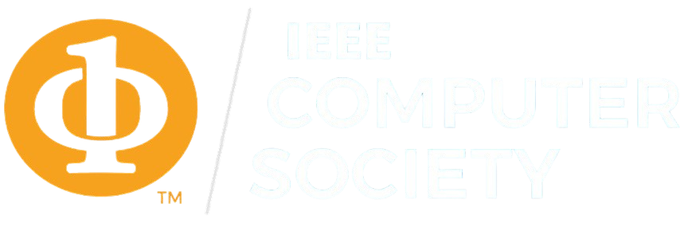

# 🌐 IEEE Computer Society VIT – Website  

<p align="center">
  
</p>

The **official website** of the IEEE Computer Society VIT chapter 🚀  
A central hub to showcase events, initiatives, and opportunities – connecting students to innovate, collaborate, and grow within the tech community.  

---

## 🛠️ Tech Stack


---

## 🚀 Getting Started  

Clone the repository and install dependencies:
```bash
git clone https://github.com/utk2602/ieee-cs-vit.git
cd frontend
npm install
Start the development server:
```shellscript
npm run dev
```

Build for production:
```shellscript
npm run build
```

# Contributing

## To contribute to this repository:

    Fork the repository
    Create a new branch with a descriptive name
    Make your changes
    Create a pull request

# Contributors
This project was developed by:

| Name | GitHub | LinkedIn |
|------|--------|----------|
| Utkarsh | [GitHub](https://github.com/utk2602) | 
| Dev Mehandru | [GitHub](https://github.com/d-e-v-14) |
| Anubhav Kayal | [GitHub](https://github.com/anubhav-kayal) | 
| Chinmay Mahto | [GitHub](https://github.com/chinmayyy01) | 
| Anwesha Laha | [GitHub](https://github.com/an-2210) |
| Anushka Gattani | [GitHub](https://github.com/Anushka13-bit) |
| Swethashree | [GitHub](https://github.com/Swetha1856) 

<p align="center">
	Made with :heart: by <a href="https://www.ieeecsvit.com/">IEEE Computer Society VIT </a>
</p>
